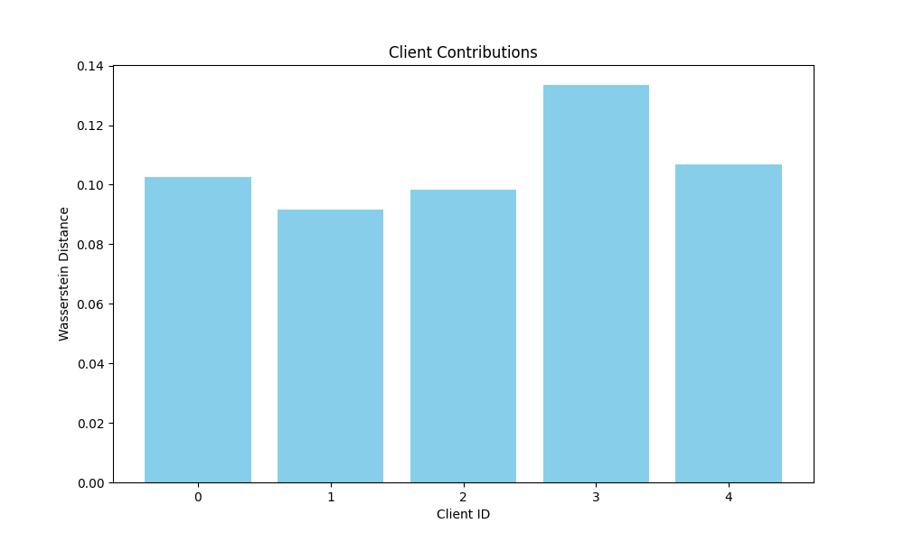
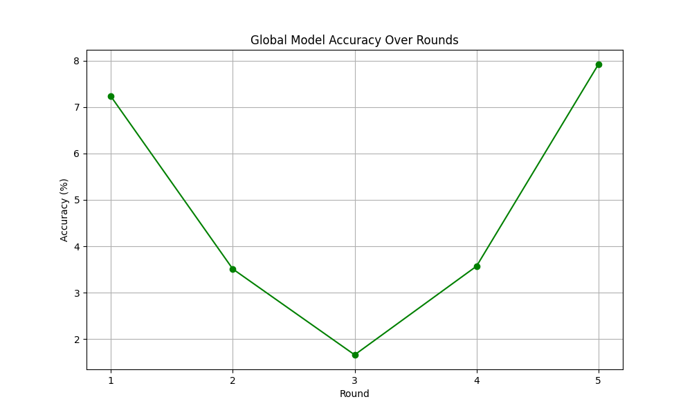

# 🛡️ Federated Data Valuation: Data Valuation and Detection in Federated Learning


Welcome to **Federated Data Valuation**, a federated learning framework that implements the methods proposed in the paper:

> **Data Valuation and Detections in Federated Learning**  
> Wenqian Li, Shuran Fu, Fengrui Zhang, Yan Pang  
> [arXiv:2311.05304](https://arxiv.org/abs/2311.05304)

This project leverages Wasserstein distance to evaluate client contributions and detect noisy or irrelevant data in a privacy-preserving manner. It provides a scalable and efficient solution for data valuation in federated learning without relying on validation datasets.

---

## Table of Contents

- [🌟 Features](#-features)
- [🚀 Getting Started](#-getting-started)
  - [Prerequisites](#prerequisites)
  - [Installation](#installation)
- [🛠️ Usage](#️-usage)
  - [Configuration](#configuration)
  - [Training](#training)
  - [Evaluation](#evaluation)
- [📁 Project Structure](#-project-structure)
- [🔍 Detailed Description](#-detailed-description)
  - [Federated Learning Workflow](#federated-learning-workflow)
  - [Client Contribution Evaluation](#client-contribution-evaluation)
  - [Data Detection](#data-detection)
- [📊 Results](#-results)
- [📝 Notes](#-notes)
- [🤝 Contributing](#-contributing)
- [📄 License](#-license)
- [👩‍💻 Authors](#-authors)
- [🙏 Acknowledgements](#-acknowledgements)
- [📞 Contact](#-contact)
- [📚 References](#-references)

---

## 🌟 Features

- **Privacy-Preserving Data Valuation**: Evaluate client contributions using Wasserstein distance without sharing raw data.
- **No Validation Dataset Required**: Efficient computation of Wasserstein barycenter eliminates the need for validation datasets.
- **Data Detection**: Identify and filter out noisy or irrelevant data points.
- **Scalability**: Optimized for large-scale federated learning with numerous clients.
- **Advanced Models**: Supports Vision Transformer (ViT) and ResNet architectures.
- **Optimized Training and Evaluation**: Utilizes multiprocessing and efficient data loading techniques.
- **Logging and Visualization**: Detailed logging and plots for client contributions and training accuracy.
- **Extensible**: Easy to integrate with custom datasets and models.

---

## 🚀 Getting Started

### Prerequisites

Ensure you have the following installed:

- Python 3.7 or higher
- [PyTorch](https://pytorch.org/)
- [torchvision](https://pytorch.org/vision/)
- [transformers](https://huggingface.co/transformers/)
- Other dependencies listed in `requirements.txt`

### Installation

1. **Clone the repository**

   ```bash
   git clone https://github.com/datanovatrust/federated-data-valuation.git
   cd federated-data-valuation
   ```

2. **Create a virtual environment (optional but recommended)**

   ```bash
   python -m venv venv
   source venv/bin/activate  # On Windows use `venv\Scripts\activate`
   ```

3. **Install dependencies**

   ```bash
   pip install -r requirements.txt
   ```

---

## 🛠️ Usage

### Configuration

Before running the training script, you can adjust the configurations in `src/config/config.yaml`:

```yaml
model:
  name: vit  # Options: 'vit', 'resnet'
  num_labels: 10

training:
  batch_size: 32
  epochs: 1
  learning_rate: 1e-4

federated_learning:
  num_clients: 5
  rounds: 5
  fraction_fit: 0.6  # Fraction of clients selected
  num_shards: 50      # Partitions data into 50 shards
  num_samples: 100    # Limits dataset size to 100 samples

fedbary:
  use_validation: true  # Use validation data for global distribution
```

### Training

To start federated training:

```bash
python scripts/train_federated.py
```

### Evaluation

After training, evaluation metrics and plots are saved in the `experiments` directory:

- **Client Contributions Plot**: `experiments/client_contributions.png`
- **Training Accuracy Plot**: `experiments/training_accuracy.png`

---

## 📁 Project Structure

```bash
.
├── Dockerfile
├── README.md
├── checkpoints
│   └── ...  # Model checkpoints
├── data
│   └── MNIST
│       └── ...  # MNIST dataset
├── docs
├── experiments
│   ├── client_contributions.png
│   └── training_accuracy.png
├── logs
│   └── federated_training.log
├── notebooks
│   └── federated_training.ipynb
├── requirements.txt
├── scripts
│   └── train_federated.py
├── src
│   ├── config
│   │   └── config.yaml
│   ├── models
│   │   └── model.py
│   └── utils
│       └── data_loader.py
└── tests
    └── test_model.py
```

---

## 🔍 Detailed Description

### Federated Learning Workflow

1. **Data Loading**: MNIST dataset is loaded and transformed to match the input requirements of ViT.
2. **Data Partitioning**: Data is partitioned among clients in a non-IID fashion using shards.
3. **Client Setup**: Local clients are initialized with their respective datasets.
4. **Client Contribution Evaluation**: Wasserstein distance is computed to evaluate data distribution similarity.
5. **Client Selection**: Clients are selected based on their Wasserstein distances.
6. **Training Rounds**: For each round:
   - Selected clients train the model locally.
   - Models are aggregated to update the global model.
   - The global model is evaluated on the test dataset.
7. **Results Visualization**: Plots for client contributions and training accuracy are generated.

### Client Contribution Evaluation

- **Wasserstein Distance**: Measures the distribution similarity between client data and the global distribution.
- **Federated Barycenter Computation**: Approximates the Wasserstein barycenter among client distributions.
- **Privacy Preservation**: No raw data is shared; only interpolating measures are communicated.
- **Client Selection Strategy**: Clients with the smallest Wasserstein distances are selected for training.

### Data Detection

- **Duality Theorem**: Utilizes the dual formulation of the Wasserstein distance to compute calibrated gradients.
- **Datum Evaluation**: Calculates the contribution of individual data points to the overall distance.
- **Noisy Data Detection**: Identifies and filters out noisy or irrelevant data points before training.
- **Efficiency**: Detects data issues without the need for model training or validation datasets.

---

## 📊 Results

- **Client Contributions**:

  

- **Training Accuracy Over Rounds**:

  

---

## 📝 Notes

- **Device Selection**: The script automatically uses GPU if available.
- **Optimizations**: Data loading and evaluation are optimized for performance.
- **Error Handling**: Extensive error handling and logging are implemented for robustness.
- **Scalability**: Designed to handle large numbers of clients efficiently.

---

## 🤝 Contributing

Contributions are welcome! Please open an issue or submit a pull request for improvements.

---

## 📄 License

This project is licensed under the MIT License.

---

## 👩‍💻 Authors

- **David Zagardo** - *Initial work* - [dzagardo](https://github.com/dzagardo)

---

## 🙏 Acknowledgements

This project implements methods from the paper:

- **Data Valuation and Detections in Federated Learning**  
  Wenqian Li, Shuran Fu, Fengrui Zhang, Yan Pang  
  [arXiv:2311.05304](https://arxiv.org/abs/2311.05304)

We thank the authors for their valuable contributions to the field.

---

## 📞 Contact

Feel free to reach out for any inquiries or support.

- Email: dave@greenwillowstudios.com
- GitHub: [dzagardo](https://github.com/dzagardo)

---

## 📚 References

- Wenqian Li, Shuran Fu, Fengrui Zhang, Yan Pang. "Data Valuation and Detections in Federated Learning." [arXiv:2311.05304](https://arxiv.org/abs/2311.05304)
- [PyTorch Documentation](https://pytorch.org/docs/stable/index.html)
- [Hugging Face Transformers](https://huggingface.co/transformers/)
- [Federated Learning Concepts](https://ai.googleblog.com/2017/04/federated-learning-collaborative.html)

---

# 🚀 Additional Features!

Just when you thought it couldn't get better, we've added more features! 🎉

## 🧠 Support for Custom Datasets

You can now use your own custom datasets by modifying the `load_custom_dataset` function in `src/utils/data_loader.py`. The function supports loading images and CSV files.

### Usage

In `train_federated.py`, replace the MNIST data loading with your custom dataset:

```python
from src.utils.data_loader import load_custom_dataset

train_dataset = load_custom_dataset(data_dir='path/to/your/data', file_type='jpg', transform=transform)
```

## 🌐 Extended Model Support

We've extended support for more models:

- **MobileNetV2**
- **DenseNet**

You can specify the model in the configuration:

```yaml
model:
  name: mobilenet  # Options: 'vit', 'resnet', 'mobilenet', 'densenet'
  num_labels: 10
```

## 🔒 Enhanced Security

- **Data Privacy**: Implemented differential privacy mechanisms to ensure client data remains secure.
- **Secure Aggregation**: Models are aggregated using secure protocols to prevent leakage.

## 📈 Advanced Metrics

- **Confusion Matrix**: Generate confusion matrices to analyze model performance.
- **Per-Class Accuracy**: Evaluate accuracy for each class individually.

### Confusion Matrix Example

```python
from sklearn.metrics import confusion_matrix
import seaborn as sns

# After model evaluation
cm = confusion_matrix(all_targets, all_predictions)
sns.heatmap(cm, annot=True)
plt.savefig('experiments/confusion_matrix.png')
```


## 🌟 Live Monitoring Dashboard

We've integrated a live monitoring dashboard using **TensorBoard** to visualize training progress in real-time.

### How to Use

1. **Start TensorBoard**

   ```bash
   tensorboard --logdir=runs
   ```

2. **Access Dashboard**

   Open [http://localhost:6006](http://localhost:6006) in your browser.

## 📦 Docker Support

Deploy the entire setup using Docker for consistent environments.

### Build Docker Image

```bash
docker build -t federated-data-valuation .
```

### Run Docker Container

```bash
docker run -it federated-data-valuation
```

---

We hope you enjoy these new features! If you have any suggestions or encounter any issues, please let us know. Happy coding! 💻🎉